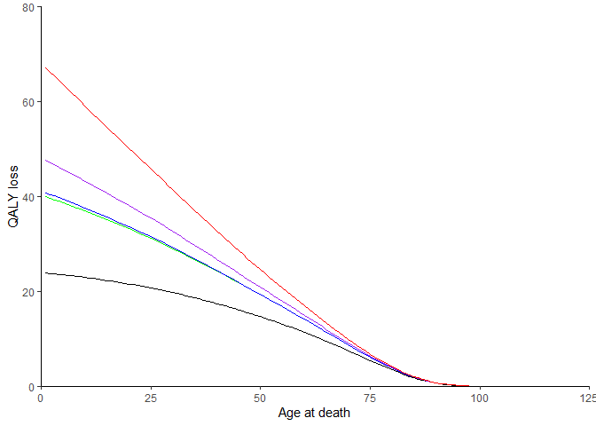

<!-- README.md is generated from README.Rmd. Please edit that file -->

# dQALY

<!-- badges: start -->
<!-- badges: end -->

<span style="color:red"> ***This package is currently under active
development and the code is subject to change.*** </span>

Our package was originally adapted from the
[COVID19_QALY_App](https://github.com/LSHTM-GHECO/COVID19_QALY_App)
built by Nichola Naylor at LSHTM. This app was itself adapted from an
[Excel
tool](https://avalonecon.com/estimating-qaly-losses-associated-with-deaths-in-hospital-covid-19/)
built by Andrew Briggs to operationalise the methods he & others set out
a [letter](https://onlinelibrary.wiley.com/doi/10.1002/hec.4208)
published in the journal Health Economics in 2020.

The goal of dQALY is to …

## Installation

You can install the development version of dQALY from
[GitHub](https://github.com/) with:

``` r
# install.packages("pak")
pak::pak("katehayes/dQALY")
```

``` r

library(dQALY)

calculate_dQALY(country = "England", year = 2019)
#>         sex age_at_death                    dQALY
#>      <char>        <int>                    <num>
#>   1: female            0 23.606988471018301112281
#>   2:   male            0 24.339255211920288957117
#>   3: female            1 23.526103795398949358741
#>   4:   male            1 24.243028622017533280086
#>   5: female            2 23.444086228346407096979
#>  ---                                             
#> 238:   male          118  0.000000000000695544319
#> 239: female          119  0.000000000001076572917
#> 240:   male          119  0.000000000000050252792
#> 241: female          120  0.000000000000061427977
#> 242:   male          120  0.000000000000002649662
```

## Discounting

To get the net present value of the losses, we apply a discount rate.
Our default discount rate is set at 3.5% as per the [NICE health
technology evaluations
manual](https://www.nice.org.uk/process/pmg36/chapter/economic-evaluation-2#discounting).
However, the most appropriate discount rate to apply in a given
evaluation/analysis is commonly subject to debate. [The Green
Book](https://www.gov.uk/government/publications/the-green-book-appraisal-and-evaluation-in-central-government/the-green-book-2020#a6-discounting),
guidance on evaluation methods issued by the Treasury, discusses a
number of discounting regimes and the reasons one might use them.

Our package allows discount rates to be specified flexibly.

``` r

# Defining a number of different discount regimes
# No discounting
r_none <- 0 #equivalently, r_none <- function(x) 0

# NICE reference case discount rate/ Green Book standard Social Time Preference Rate
r_standard <- 0.035 #equivalently, r_standard <- function(x) 0.035
# NICE alternative discount rate/Green Book recommended discount rate for health or life values
r_health <- 0.015 #equivalently, r_health <- function(x) 0.015

# Long term discounting
# Green Book recommended declining long term discount rate for health or life values
r_health_lt <- function(x) ifelse(x < 31, 0.015, ifelse(x > 75, 0.0107, 0.0129))
# Green Book recommended rate reduced by excluding pure social time preference
# (relevant if intervention may effect substantial/irreversible wealth transfers between generations)
r_health_lt_reduced <- function(x) ifelse(x < 31, 0.01, ifelse(x > 75, 0.0071, 0.0086))


# Plotting QALY loss due to death for England in 2019, 
# as discount regimes vary

library(ggplot2)

ggplot(data = calculate_dQALY(country = "England", year = 2019, 
                              sex_group = T), #equivalently, r = r_standard
       aes(x = age_at_death, y = dQALY)) +
  geom_line() +
  geom_line(data = calculate_dQALY(country = "England", year = 2019, 
                                   sex_group = T,
                                   r = r_health),
            colour = "green") +
  geom_line(data = calculate_dQALY(country = "England", year = 2019, 
                                   sex_group = T,
                                   r = r_health_lt),
            colour = "blue") +
  geom_line(data = calculate_dQALY(country = "England", year = 2019, 
                                   sex_group = T,
                                   r = r_health_lt_reduced),
            colour = "purple") +
  geom_line(data = calculate_dQALY(country = "England", year = 2019, 
                                   sex_group = T,
                                   r = r_none),
            colour = "red") +
  scale_x_continuous(name = "Age at death",
                     limits = c(0, 125),
                     expand = c(0,0)) +
  scale_y_continuous(name = "QALY loss",
                     limits = c(0, 80),
                     expand = c(0,0)) +
  theme_classic()
```



## Utility norms

The available utility norms can be viewed using the ***get_norm_info***
function. Results can be filtered by country, and returned with or
without reference information.

``` r


# Return all utility norm sets for all countries (10 rows only)
print(get_norm_info(), class = FALSE, nrows = 10)
#> Index: <norm_id>
#>           norm_id             norm_country eq5d_data_version eq5d_data_year
#>  1: janssen_euvas                Argentina          EQ-5D-3L           2005
#>  2:   janssen_tto                Argentina          EQ-5D-3L           2005
#>  3:   janssen_vas                Argentina          EQ-5D-3L           2005
#>  4: janssen_euvas                  Belgium          EQ-5D-3L      2001–2003
#>  5:   janssen_vas                  Belgium          EQ-5D-3L      2001–2003
#> ---                                                                        
#> 39:   janssen_tto           United Kingdom          EQ-5D-3L           1993
#> 40:   janssen_vas           United Kingdom          EQ-5D-3L           1993
#> 41:           mvh           United Kingdom          EQ-5D-3L           1993
#> 42: janssen_euvas United States of America          EQ-5D-3L      2000–2002
#> 43:   janssen_tto United States of America          EQ-5D-3L      2000–2002
#>            value_set_country value_set_version value_set_type value_set_year
#>  1:                   Europe                              VAS               
#>  2:                Argentina                              TTO               
#>  3:                Argentina                              VAS               
#>  4:                   Europe                              VAS               
#>  5:                  Belgium                              VAS               
#> ---                                                                         
#> 39:           United Kingdom                              TTO               
#> 40:           United Kingdom                              VAS               
#> 41:           United Kingdom          EQ-5D-3L            TTO           1993
#> 42:                   Europe                              VAS               
#> 43: United States of America                              TTO               
#>     default
#>  1:   FALSE
#>  2:    TRUE
#>  3:   FALSE
#>  4:   FALSE
#>  5:    TRUE
#> ---        
#> 39:   FALSE
#> 40:   FALSE
#> 41:    TRUE
#> 42:   FALSE
#> 43:    TRUE

# Return all English utility norm sets with reference information
print(get_norm_info(country = "England", references = T), class = FALSE)
#>          norm_id norm_country eq5d_data_version eq5d_data_year
#> 1: janssen_euvas      England          EQ-5D-3L           2008
#> 2:   janssen_tto      England          EQ-5D-3L           2008
#> 3:   janssen_vas      England          EQ-5D-3L           2008
#> 4:           vih      England          EQ-5D-5L      2017/2018
#>    value_set_country value_set_version value_set_type value_set_year
#> 1:            Europe                              VAS               
#> 2:           England                              TTO               
#> 3:           England                              VAS               
#> 4:           England          EQ-5D-3L            TTO           1993
#>                       norm_doi
#> 1: 10.1007/978-94-007-7596-1_3
#> 2: 10.1007/978-94-007-7596-1_3
#> 3: 10.1007/978-94-007-7596-1_3
#> 4:  10.1016/j.jval.2022.07.005
#>                                                                       norm_url
#> 1:                               https://www.ncbi.nlm.nih.gov/books/NBK500364/
#> 2:                               https://www.ncbi.nlm.nih.gov/books/NBK500364/
#> 3:                               https://www.ncbi.nlm.nih.gov/books/NBK500364/
#> 4: https://www.valueinhealthjournal.com/article/S1098-3015(22)02101-5/fulltext
#>    default
#> 1:   FALSE
#> 2:   FALSE
#> 3:   FALSE
#> 4:    TRUE
```
