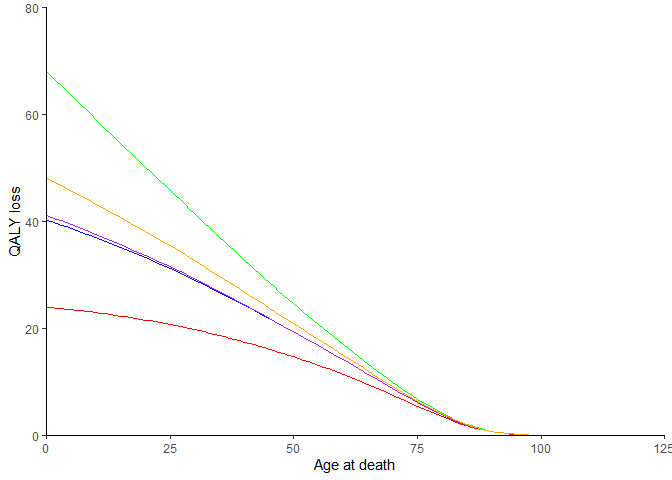

<!-- devtools::build_readme() -->

<!-- README.md is generated from README.Rmd. Please edit that file -->

# dQALY

<!-- badges: start -->

<!-- badges: end -->

<span style="color:red"> ***This package is currently under active
development and the code is subject to change.*** </span>

The quality-adjusted life year, or QALY, is a widely used outcome
measure in the field of health economics. When evaluating the impact of
a policy/programme/intervention, we often want to express the health
impacts of preventing or failing to prevent a death in terms of the
QALYs that would be gained or lost.

The goal of the dQALY package is to provide an easy and flexible way of
calculating the number of QALYs that are ‘lost’ when a person dies.

This package has been built using code adapted from the
[COVID19_QALY_App](https://github.com/LSHTM-GHECO/COVID19_QALY_App),
written by Nichola Naylor at LSHTM. The
[COVID19_QALY_App](https://github.com/LSHTM-GHECO/COVID19_QALY_App) was
itself adapted from an [Excel
tool](https://avalonecon.com/estimating-qaly-losses-associated-with-deaths-in-hospital-covid-19/)
built by Andrew Briggs to operationalise the methods for calculating
QALY loss due to death that he & others set out in a
[letter](https://onlinelibrary.wiley.com/doi/10.1002/hec.4208) published
in the journal Health Economics in 2020.
<!-- Some of the setup borrowed from qalytools & eq5d packages -->

## Installation

You can install the development version of dQALY from
[GitHub](https://github.com/) with:

``` r
# install.packages("pak")
pak::pak("katehayes/dQALY")
```

## Calculating QALY loss due to death with life expectancy & quality of life data

Add overview of methods. Using life tables & HRQoL norms. HRQoL norms
themselves are constructed from health state data & value sets.

## Health related quality of life (HRQoL) population norm data

**\[Explain norms\]** Some discussion of HRQoL norms can be found on the
[EuroQol
website](https://euroqol.org/information-and-support/resources/population-norms/).

For most countries, there is more than one set of HRQoL norms stored in
the package data. For every country, we have chosen a set of default
norms - these are the norms that will be used when the `calculate_dQALY`
function is called without specifying a value for the `norms` argument.
Alternatively, the user can specify what set of package norms they would
like to use by passing its ID to `norms`. It is also possible for the
user to supply custom norms.

The list of available HRQoL norms and their IDs can be viewed using the
`hrqol_norms` function. This function also returns information we have
documented about the make-up ofeach set of HRQoL norms - specifically,
about the EQ-5D data and value sets from which the norms are estimated.
We have tried to adopt the same terminology/categorisation scheme used
by the eq5d package to document information about value sets. Results
can be filtered by country, and returned with or without reference
information.
<!-- Note: we could also store info about the model used to estimate the pop-level norms from the input data (eq5d profiles valued w the value sets) - e.g. in the ViH paper they use a linear model -->

``` r
library(dQALY)

# Return all English utility norm sets without reference information
head(hrqol_norms(country = "England", references = F))
#>   norm_country eq5d_data_year       norm_id eq5d_data_version value_set_country
#> 1      England           2008 janssen_euvas          EQ-5D-3L            Europe
#> 2      England           2008   janssen_tto          EQ-5D-3L           England
#> 3      England           2008   janssen_vas          EQ-5D-3L           England
#> 4      England      2017-2018   vih_primary          EQ-5D-5L           England
#> 5      England      2017-2018 vih_secondary          EQ-5D-5L           England
#>   value_set_version value_set_type value_set_year default
#> 1          EQ-5D-3L            VAS                  FALSE
#> 2          EQ-5D-3L            TTO                  FALSE
#> 3          EQ-5D-3L            VAS                  FALSE
#> 4          EQ-5D-3L            DSU           1993    TRUE
#> 5          EQ-5D-3L             CW           1993   FALSE
```

We can see that the package stores five different sets of English HRQoL
population norm data. We can also see how these norms differ from each
other with regards to what population the health state was data gathered
from/ what population valued the health states/ when the was data
collected/ what methods were used to elicit the states/values.
Hopefully, being able to access this information allows the user to
understand the implications of choosing one set of norms over another -
and to make a judgement about the set of norms that is most appropriate
for their purposes.

<!-- What modelling methods were used to estimate population averages? -->

## Discounting

To get the net present value of the losses, we apply a discount rate. In
our package, the default discount rate is set at 3.5% as per the [NICE
health technology evaluations
manual](https://www.nice.org.uk/process/pmg36/chapter/economic-evaluation-2#discounting).
However, the most appropriate discount rate to apply in a given
evaluation/analysis is commonly subject to debate. [The Green
Book](https://www.gov.uk/government/publications/the-green-book-appraisal-and-evaluation-in-central-government/the-green-book-2020#a6-discounting),
guidance on evaluation methods issued by the Treasury, discusses a
number of discounting regimes and the reasons one might use them.

Our package allows discount rates to be specified flexibly.

<table>

<tbody>

<tr>

<td>

`r_none`
</td>

<td>

No discounting
</td>

</tr>

<tr>

<td>

`r_default`
</td>

<td>

NICE reference case discount rate/ Green Book standard Social Time
Preference Rate
</td>

</tr>

<tr>

<td>

`r_health`
</td>

<td>

NICE alternative discount rate/Green Book recommended discount rate for
health or life values
</td>

</tr>

<tr>

<td>

`r_lt_health`
</td>

<td>

Green Book recommended declining long term discount rate for health or
life values
</td>

</tr>

<tr>

<td>

`r_lt_health_reduced`
</td>

<td>

Green Book recommended rate reduced by excluding pure social time
preference (relevant if intervention may effect substantial/irreversible
wealth transfers between generations)
</td>

</tr>

</tbody>

</table>

``` r
library(dQALY)
library(ggplot2)

years <- c(0:125)
  
ggplot() +
  geom_line(aes(x = years, y = r_none(years)), colour = "green") +
  geom_line(aes(x = years, y = r_default(years)), colour = "red") +
  geom_line(aes(x = years, y = r_health(years)), colour = "blue") +
  geom_line(aes(x = years, y = r_lt_health(years)), colour = "purple") +
  geom_line(aes(x = years, y = r_lt_health_reduced(years)), colour = "orange") +
  scale_x_continuous(name = "Number of years into the future",
                     limits = c(0, 125),
                     expand = c(0,0)) +
  scale_y_continuous(name = "Discount rate",
                     limits = c(-0.00013, 0.0355),
                     expand = c(0,0)) +
  theme_classic()
```


``` r


ggplot(data = calculate_dQALY(country = "England", year = 2019, 
                              collapse_sex = T,
                              r = r_none), 
       aes(x = age_at_death, y = dQALY)) +
  geom_line(colour = "green") +
  geom_line(data = calculate_dQALY(country = "England", year = 2019, 
                                   collapse_sex = T,
                                   r = r_default),
            colour = "red") +
  geom_line(data = calculate_dQALY(country = "England", year = 2019,
                                   collapse_sex = T,
                                   r = r_health),
            colour = "blue") +
  geom_line(data = calculate_dQALY(country = "England", year = 2019, 
                                   collapse_sex = T,
                                   r = r_lt_health),
            colour = "purple") +
  geom_line(data = calculate_dQALY(country = "England", year = 2019, 
                                   collapse_sex = T,
                                   r = r_lt_health_reduced),
            colour = "orange") +
  scale_x_continuous(name = "Age at death",
                     limits = c(0, 125),
                     expand = c(0,0)) +
  scale_y_continuous(name = "QALY loss",
                     limits = c(0, 80),
                     expand = c(0,0)) +
  theme_classic()
```


