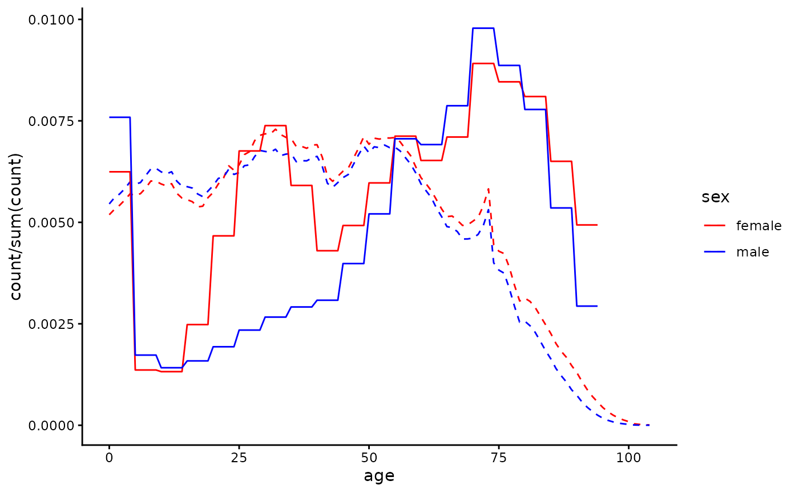
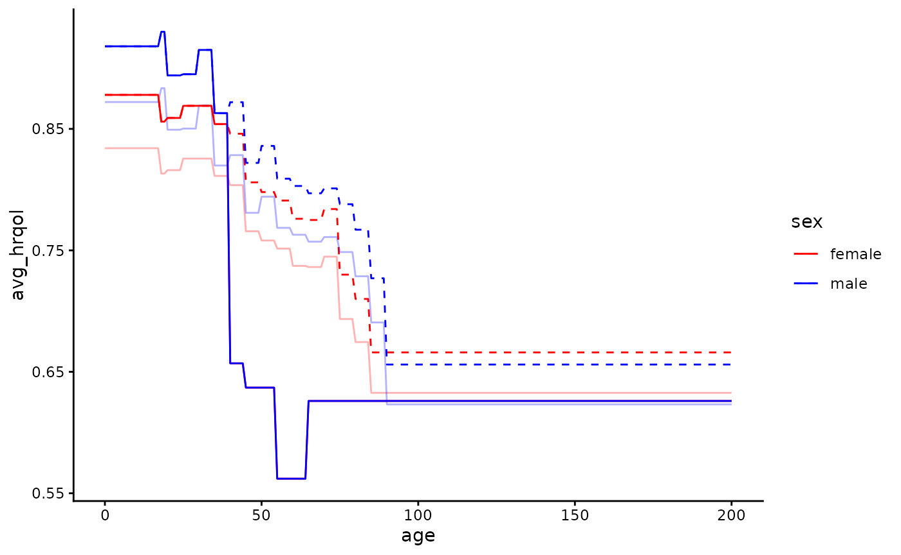
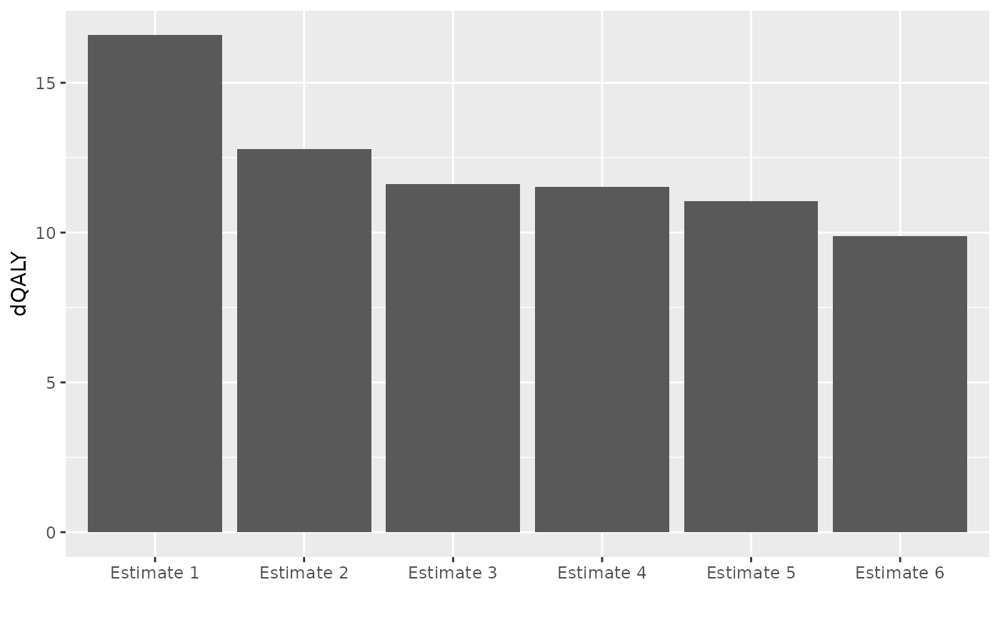

# Demo

``` r
library(dQALY)
library(data.table)
library(readxl)
library(ggplot2)
```

## Worked example: using the dQALY package to value outputs of an infectious disease model

Imagine that we had built an infectious disease model, simulating CPE
bloodstream infections among English hospital inpatients & the deaths
resulting from those infections. Imagine that because of data
availability, the model population does not have sex/age structure. We
want to produce a single estimate of the average number of QALYs that
would be lost on the death of a person in our model - this single
estimate will be used to value all deaths.

We’ll use this example to demonstrate why or how one might use several
of the features of the `calculate_dQALY` function - specifically, the
features that enable the estimation of QALY losses for user-supplied
cohorts and groups.

Firstly, we’ll make the age groups we need to supply to the function. We
want to group all ages together:

``` r
all_ages <- data.table(lower = 0, upper = 100)
```

We could use the default data stored in the package and produce an
estimate of the average number of QALYs lost on the death of a person
from the English population. We supply our defined age groups to the
argument `collapse_age` and set the argument `collapse_sex` to `TRUE`:

``` r
calculate_dQALY(country = "England", year = 2020,
                collapse_age = all_ages,
                collapse_sex = TRUE)
#>     age lower upper    dQALY
#> 1 0-100     0   100 16.58649
```

However, the average QALYs lost due to death in the general English
population is probably different to the QALYs lost on the death of an
English hospital inpatient. We could make several adjustments to the
calculation in order to try to produce a more accurate estimate.

### Adjusting the cohort data

When we use either the `collapse_age` or `collapse_sex` arguments, the
function uses what we’ll refer to as ‘cohort data’ - information on the
age/sex distribution of the relevant population - to produce weighted
means for the various population groups we require. When the argument
`country` is set to England, the default cohort data used in the
calculation is English population data from the ONS. But we know that
the age/sex distribution of hospital inpatients is different from the
age/sex distribution of the population at large. Instead of using the
default English population data stored by the package, we’ll construct a
new cohort using English hospital admissions data and supply this to the
function instead.

``` r
# Using data on Hospital Admitted Patient Care Activity, 2019-20
# https://digital.nhs.uk/data-and-information/publications/statistical/hospital-admitted-patient-care-activity/2019-20/summary-reports---apc---patient

temp <- tempfile(fileext = ".xlsx")
download.file(url = "https://digital.nhs.uk/binaries/content/documents/corporate-website/publication-system/statistical/hospital-admitted-patient-care-activity/2019-20/summary-reports---apc---patient/summary-reports---apc---patient/publicationsystem%3AbodySections%5B2%5D/publicationsystem%3AdataFile",
              temp, mode = "wb")

hospital_cohort <- as.data.table(readxl::read_xlsx(temp, sheet = 1)) |>
  setnames(new = c("age", "male", "female")) |>
  melt(measure.vars = c("male", "female"),
       variable.name = "sex",
       value.name = "count")

hospital_cohort <- hospital_cohort[age != "Unknown"][
  , lower := as.numeric(substring(age, 1, 2))
][
  , upper := lower + 4
][
  , .(age = c(lower:upper), count = rep(count/5, 5)), by = c("lower", "upper", "sex")
][
  , c("lower", "upper"):=NULL
]
```

Let’s examine the difference between the default cohort used in the
calculation and this new hospital cohort we constructed, to get a sense
of how switching cohorts will affect the output of the calculation. We
can use the relevant package data function - `package_cohort` - to
return the cohort data stored in the package, and then plot it against
our hospital cohort:

``` r
default_cohort <- package_cohort(country = "England", year = 2020)

ggplot() +
  geom_line(data = default_cohort,
               aes(x = age, y = count/sum(count), colour = sex), linetype = 2) +
  geom_line(data = hospital_cohort,
               aes(x = age, y = count/sum(count), colour = sex)) +
  theme_classic() +
  scale_colour_manual(values = c("red", "blue"))
```



Now we’ll re-do the calculation, supplying the `hospital_cohort` data to
the `cohort` argument of the function. We can see that when using a
hospital cohort the QALY loss estimate we produce is smaller, as the
hospital population is older than the population at large and QALY loss
decreases with age at death:

``` r
calculate_dQALY(country = "England", year = 2020,
                collapse_age = all_ages,
                collapse_sex = TRUE,
                cohort = hospital_cohort)
#>     age lower upper   dQALY
#> 1 0-100     0   100 12.7969
```

We now have an estimate of the average QALY loss caused by the death of
a patient chosen randomly from hospital inpatients. But rates of CPE
infection and/or CPE mortality given infection differ by age and
gender - both infection and death from infection are more likely in
older age groups. Instead of using a cohort with age/sex distribution
representative of all hospital inpatients, we might want to use a cohort
with age/sex distribution representing hospital inpatients who die of
CPE infection. Researchers with access to mortality data for those with
hospital-acquired CPE could use that data to make a cohort - here we’ll
make very a crude adjustment, applying weights to those over 60 so that
they are over-represented in the cohort, to reflect their greater risk
of death:

``` r
adj_hospital_cohort <- copy(hospital_cohort)[age > 60, count := count*1.5]

calculate_dQALY(country = "England", year = 2020,
                collapse_age = all_ages,
                collapse_sex = TRUE,
                cohort = adj_hospital_cohort)
#>     age lower upper    dQALY
#> 1 0-100     0   100 11.63132
```

### Adjusting the life expectancy data

What if we wanted to account for the fact that life expectancy among
people who are likely to be in hospital at any given time is probably
worse than it is in the general population? A quick and easy way to do
this is to use the argument `smr` (standard mortality ratio) to make
adjustments to the default life tables used in the calculation - for
details about how exactly this adjustment happens, refer to the [methods
vignette](https://katehayes.github.io/dQALY/articles/methods.md). The
default value of the argument is 1 - here we’re going to increase
mortality rates by 5% at each year of age:

``` r
calculate_dQALY(country = "England", year = 2020,
                smr = 1.05,
                collapse_age = all_ages,
                collapse_sex = TRUE,
                cohort = adj_hospital_cohort)
#>     age lower upper    dQALY
#> 1 0-100     0   100 11.53195
```

However, if you had your own data that you felt better represented the
life expectancy of an inpatient population, you could supply it directly
to the function (to the argument `life_table`) rather than adjusting the
data that is already stored in the package.

### Adjusting the utility data

What if we wanted to account for the fact that hospital patients likely
have greater morbidity than the general population? Like we used the
argument `smr` to adjust the life tables, we can use the argument `qcm`
to adjust the utility norms for the general English population - here
we’re going to make utility scores 5% lower across the board:

``` r
calculate_dQALY(country = "England", year = 2020,
                qcm = 0.95,
                collapse_age = all_ages,
                collapse_sex = TRUE,
                cohort = adj_hospital_cohort)
#>     age lower upper    dQALY
#> 1 0-100     0   100 11.04975
```

Again, instead of making adjustments to the default utility data from
the general English population, we could alternatively try to find
utility data collected from a population that we think is closer to the
population we’d like to represent. Here’s an example of how we might go
about that.

``` r
# Retrieving data from a study that collected HRQoL of people with long term conditions in UK
url <- "https://www.ncbi.nlm.nih.gov/books/NBK592229/table/table18/?report=objectonly"
element <- ".large_tbl"

ltc_norms <-  rvest::read_html(url) |>
    rvest::html_element(element) |>
    rvest::html_table(fill = T) |>
    as.data.table()

# Cleaning up the utility data, putting it in the form required by the function
names <- ltc_norms[1, ] |>
  unlist()
setnames(ltc_norms, new = names)

ltc_norms <- ltc_norms[4, -c(1,3,5,7,9:11)] |>
  melt(measure.vars = patterns("years"),
       variable.name = "lower",
       value.name = "avg_hrqol")

ltc_norms[, avg_hrqol := as.numeric(substring(avg_hrqol, 1, 5))]
ltc_norms[, upper := as.numeric(substring(lower, 4, 5))]
ltc_norms[, lower := as.numeric(substring(lower, 1, 2))]
ltc_norms <- ltc_norms[, .(sex = c("male", "female")), by = c("lower", "upper", "avg_hrqol")]
```

This study only has utility data for age groups covering ages 40-74.
We’ll assume all older ages have the same utility as the oldest group
for which we have data, and for younger age groups we’ll use the general
population norms. We can return and then manipulate those norms using
the function `package_norms`:

``` r
ltc_norms[upper == max(upper), upper := 200]

default_norms <- package_norms(country = "England") |> as.data.table()
ltc_norms <- rbind(default_norms[lower < 40], ltc_norms)
```

It’s up to us to make a judgement about whether these new norms better
approximate the HRQoL in the population we’re modelling than the default
norms for the general population. We can plot our new utility norms
against the default norms (and also if we want against the norms when
adjusted using the `qcm` argument) to help make this judgement:

``` r
ggplot() +
  geom_line(data = default_norms[, .(age = c(lower:upper)), by = c("lower", "upper", "sex", "avg_hrqol")],
            aes(x = age, y = avg_hrqol, colour = sex), linetype = 2) +
    geom_line(data = default_norms[, .(age = c(lower:upper)), by = c("lower", "upper", "sex", "avg_hrqol")],
            aes(x = age, y = avg_hrqol*0.95, colour = sex), alpha = 0.3) +
  geom_line(data = ltc_norms[, .(age = c(lower:upper)), by = c("lower", "upper", "sex", "avg_hrqol")],
            aes(x = age, y = avg_hrqol, colour = sex)) +
  theme_classic() +
  scale_colour_manual(values = c("red", "blue"))
```



Then we can (if we judge they’re more suitable) use the new norms in our
calculation by supplying the data to the argument `norms`:

``` r
calculate_dQALY(country = "England", year = 2020,
                norms = ltc_norms,
                collapse_age = all_ages,
                collapse_sex = TRUE,
                cohort = adj_hospital_cohort)
#>     age lower upper    dQALY
#> 1 0-100     0   100 9.886051
```

### Examining our various estimates

``` r
estimates <- data.table(estimate = c("Estimate 1", "Estimate 2",
                                     "Estimate 3", "Estimate 4",
                                     "Estimate 5", "Estimate 6"),
                        dQALY = c(calculate_dQALY(country = "England", year = 2020,
                                                  collapse_age = all_ages,
                                                  collapse_sex = TRUE)$dQALY,
                                  calculate_dQALY(country = "England", year = 2020,
                                                  collapse_age = all_ages,
                                                  collapse_sex = TRUE,
                                                  cohort = hospital_cohort)$dQALY,
                                  calculate_dQALY(country = "England", year = 2020,
                                                  collapse_age = all_ages,
                                                  collapse_sex = TRUE,
                                                  cohort = adj_hospital_cohort)$dQALY,
                                  calculate_dQALY(country = "England", year = 2020,
                                                  smr = 1.05,
                                                  collapse_age = all_ages,
                                                  collapse_sex = TRUE,
                                                  cohort = adj_hospital_cohort)$dQALY,
                                  calculate_dQALY(country = "England", year = 2020,
                                                  qcm = 0.95,
                                                  collapse_age = all_ages,
                                                  collapse_sex = TRUE,
                                                  cohort = adj_hospital_cohort)$dQALY,
                                  calculate_dQALY(country = "England", year = 2020,
                                                  norms = ltc_norms,
                                                  collapse_age = all_ages,
                                                  collapse_sex = TRUE,
                                                  cohort = adj_hospital_cohort)$dQALY))


ggplot(data = estimates) +
  geom_bar(aes(x = estimate, y = dQALY),
           stat = "identity") +
  scale_x_discrete(name = "")
```



``` r
  theme_classic()
#> <theme> List of 144
#>  $ line                            : <ggplot2::element_line>
#>   ..@ colour       : chr "black"
#>   ..@ linewidth    : num 0.5
#>   ..@ linetype     : num 1
#>   ..@ lineend      : chr "butt"
#>   ..@ linejoin     : chr "round"
#>   ..@ arrow        : logi FALSE
#>   ..@ arrow.fill   : chr "black"
#>   ..@ inherit.blank: logi TRUE
#>  $ rect                            : <ggplot2::element_rect>
#>   ..@ fill         : chr "white"
#>   ..@ colour       : chr "black"
#>   ..@ linewidth    : num 0.5
#>   ..@ linetype     : num 1
#>   ..@ linejoin     : chr "round"
#>   ..@ inherit.blank: logi TRUE
#>  $ text                            : <ggplot2::element_text>
#>   ..@ family       : chr ""
#>   ..@ face         : chr "plain"
#>   ..@ italic       : chr NA
#>   ..@ fontweight   : num NA
#>   ..@ fontwidth    : num NA
#>   ..@ colour       : chr "black"
#>   ..@ size         : num 11
#>   ..@ hjust        : num 0.5
#>   ..@ vjust        : num 0.5
#>   ..@ angle        : num 0
#>   ..@ lineheight   : num 0.9
#>   ..@ margin       : <ggplot2::margin> num [1:4] 0 0 0 0
#>   ..@ debug        : logi FALSE
#>   ..@ inherit.blank: logi TRUE
#>  $ title                           : <ggplot2::element_text>
#>   ..@ family       : NULL
#>   ..@ face         : NULL
#>   ..@ italic       : chr NA
#>   ..@ fontweight   : num NA
#>   ..@ fontwidth    : num NA
#>   ..@ colour       : NULL
#>   ..@ size         : NULL
#>   ..@ hjust        : NULL
#>   ..@ vjust        : NULL
#>   ..@ angle        : NULL
#>   ..@ lineheight   : NULL
#>   ..@ margin       : NULL
#>   ..@ debug        : NULL
#>   ..@ inherit.blank: logi TRUE
#>  $ point                           : <ggplot2::element_point>
#>   ..@ colour       : chr "black"
#>   ..@ shape        : num 19
#>   ..@ size         : num 1.5
#>   ..@ fill         : chr "white"
#>   ..@ stroke       : num 0.5
#>   ..@ inherit.blank: logi TRUE
#>  $ polygon                         : <ggplot2::element_polygon>
#>   ..@ fill         : chr "white"
#>   ..@ colour       : chr "black"
#>   ..@ linewidth    : num 0.5
#>   ..@ linetype     : num 1
#>   ..@ linejoin     : chr "round"
#>   ..@ inherit.blank: logi TRUE
#>  $ geom                            : <ggplot2::element_geom>
#>   ..@ ink        : chr "black"
#>   ..@ paper      : chr "white"
#>   ..@ accent     : chr "#3366FF"
#>   ..@ linewidth  : num 0.5
#>   ..@ borderwidth: num 0.5
#>   ..@ linetype   : int 1
#>   ..@ bordertype : int 1
#>   ..@ family     : chr ""
#>   ..@ fontsize   : num 3.87
#>   ..@ pointsize  : num 1.5
#>   ..@ pointshape : num 19
#>   ..@ colour     : NULL
#>   ..@ fill       : NULL
#>  $ spacing                         : 'simpleUnit' num 5.5points
#>   ..- attr(*, "unit")= int 8
#>  $ margins                         : <ggplot2::margin> num [1:4] 5.5 5.5 5.5 5.5
#>  $ aspect.ratio                    : NULL
#>  $ axis.title                      : NULL
#>  $ axis.title.x                    : <ggplot2::element_text>
#>   ..@ family       : NULL
#>   ..@ face         : NULL
#>   ..@ italic       : chr NA
#>   ..@ fontweight   : num NA
#>   ..@ fontwidth    : num NA
#>   ..@ colour       : NULL
#>   ..@ size         : NULL
#>   ..@ hjust        : NULL
#>   ..@ vjust        : num 1
#>   ..@ angle        : NULL
#>   ..@ lineheight   : NULL
#>   ..@ margin       : <ggplot2::margin> num [1:4] 2.75 0 0 0
#>   ..@ debug        : NULL
#>   ..@ inherit.blank: logi TRUE
#>  $ axis.title.x.top                : <ggplot2::element_text>
#>   ..@ family       : NULL
#>   ..@ face         : NULL
#>   ..@ italic       : chr NA
#>   ..@ fontweight   : num NA
#>   ..@ fontwidth    : num NA
#>   ..@ colour       : NULL
#>   ..@ size         : NULL
#>   ..@ hjust        : NULL
#>   ..@ vjust        : num 0
#>   ..@ angle        : NULL
#>   ..@ lineheight   : NULL
#>   ..@ margin       : <ggplot2::margin> num [1:4] 0 0 2.75 0
#>   ..@ debug        : NULL
#>   ..@ inherit.blank: logi TRUE
#>  $ axis.title.x.bottom             : NULL
#>  $ axis.title.y                    : <ggplot2::element_text>
#>   ..@ family       : NULL
#>   ..@ face         : NULL
#>   ..@ italic       : chr NA
#>   ..@ fontweight   : num NA
#>   ..@ fontwidth    : num NA
#>   ..@ colour       : NULL
#>   ..@ size         : NULL
#>   ..@ hjust        : NULL
#>   ..@ vjust        : num 1
#>   ..@ angle        : num 90
#>   ..@ lineheight   : NULL
#>   ..@ margin       : <ggplot2::margin> num [1:4] 0 2.75 0 0
#>   ..@ debug        : NULL
#>   ..@ inherit.blank: logi TRUE
#>  $ axis.title.y.left               : NULL
#>  $ axis.title.y.right              : <ggplot2::element_text>
#>   ..@ family       : NULL
#>   ..@ face         : NULL
#>   ..@ italic       : chr NA
#>   ..@ fontweight   : num NA
#>   ..@ fontwidth    : num NA
#>   ..@ colour       : NULL
#>   ..@ size         : NULL
#>   ..@ hjust        : NULL
#>   ..@ vjust        : num 1
#>   ..@ angle        : num -90
#>   ..@ lineheight   : NULL
#>   ..@ margin       : <ggplot2::margin> num [1:4] 0 0 0 2.75
#>   ..@ debug        : NULL
#>   ..@ inherit.blank: logi TRUE
#>  $ axis.text                       : <ggplot2::element_text>
#>   ..@ family       : NULL
#>   ..@ face         : NULL
#>   ..@ italic       : chr NA
#>   ..@ fontweight   : num NA
#>   ..@ fontwidth    : num NA
#>   ..@ colour       : NULL
#>   ..@ size         : 'rel' num 0.8
#>   ..@ hjust        : NULL
#>   ..@ vjust        : NULL
#>   ..@ angle        : NULL
#>   ..@ lineheight   : NULL
#>   ..@ margin       : NULL
#>   ..@ debug        : NULL
#>   ..@ inherit.blank: logi TRUE
#>  $ axis.text.x                     : <ggplot2::element_text>
#>   ..@ family       : NULL
#>   ..@ face         : NULL
#>   ..@ italic       : chr NA
#>   ..@ fontweight   : num NA
#>   ..@ fontwidth    : num NA
#>   ..@ colour       : NULL
#>   ..@ size         : NULL
#>   ..@ hjust        : NULL
#>   ..@ vjust        : num 1
#>   ..@ angle        : NULL
#>   ..@ lineheight   : NULL
#>   ..@ margin       : <ggplot2::margin> num [1:4] 2.2 0 0 0
#>   ..@ debug        : NULL
#>   ..@ inherit.blank: logi TRUE
#>  $ axis.text.x.top                 : <ggplot2::element_text>
#>   ..@ family       : NULL
#>   ..@ face         : NULL
#>   ..@ italic       : chr NA
#>   ..@ fontweight   : num NA
#>   ..@ fontwidth    : num NA
#>   ..@ colour       : NULL
#>   ..@ size         : NULL
#>   ..@ hjust        : NULL
#>   ..@ vjust        : num 0
#>   ..@ angle        : NULL
#>   ..@ lineheight   : NULL
#>   ..@ margin       : <ggplot2::margin> num [1:4] 0 0 2.2 0
#>   ..@ debug        : NULL
#>   ..@ inherit.blank: logi TRUE
#>  $ axis.text.x.bottom              : NULL
#>  $ axis.text.y                     : <ggplot2::element_text>
#>   ..@ family       : NULL
#>   ..@ face         : NULL
#>   ..@ italic       : chr NA
#>   ..@ fontweight   : num NA
#>   ..@ fontwidth    : num NA
#>   ..@ colour       : NULL
#>   ..@ size         : NULL
#>   ..@ hjust        : num 1
#>   ..@ vjust        : NULL
#>   ..@ angle        : NULL
#>   ..@ lineheight   : NULL
#>   ..@ margin       : <ggplot2::margin> num [1:4] 0 2.2 0 0
#>   ..@ debug        : NULL
#>   ..@ inherit.blank: logi TRUE
#>  $ axis.text.y.left                : NULL
#>  $ axis.text.y.right               : <ggplot2::element_text>
#>   ..@ family       : NULL
#>   ..@ face         : NULL
#>   ..@ italic       : chr NA
#>   ..@ fontweight   : num NA
#>   ..@ fontwidth    : num NA
#>   ..@ colour       : NULL
#>   ..@ size         : NULL
#>   ..@ hjust        : num 0
#>   ..@ vjust        : NULL
#>   ..@ angle        : NULL
#>   ..@ lineheight   : NULL
#>   ..@ margin       : <ggplot2::margin> num [1:4] 0 0 0 2.2
#>   ..@ debug        : NULL
#>   ..@ inherit.blank: logi TRUE
#>  $ axis.text.theta                 : NULL
#>  $ axis.text.r                     : <ggplot2::element_text>
#>   ..@ family       : NULL
#>   ..@ face         : NULL
#>   ..@ italic       : chr NA
#>   ..@ fontweight   : num NA
#>   ..@ fontwidth    : num NA
#>   ..@ colour       : NULL
#>   ..@ size         : NULL
#>   ..@ hjust        : num 0.5
#>   ..@ vjust        : NULL
#>   ..@ angle        : NULL
#>   ..@ lineheight   : NULL
#>   ..@ margin       : <ggplot2::margin> num [1:4] 0 2.2 0 2.2
#>   ..@ debug        : NULL
#>   ..@ inherit.blank: logi TRUE
#>  $ axis.ticks                      : <ggplot2::element_line>
#>   ..@ colour       : NULL
#>   ..@ linewidth    : NULL
#>   ..@ linetype     : NULL
#>   ..@ lineend      : NULL
#>   ..@ linejoin     : NULL
#>   ..@ arrow        : logi FALSE
#>   ..@ arrow.fill   : NULL
#>   ..@ inherit.blank: logi TRUE
#>  $ axis.ticks.x                    : NULL
#>  $ axis.ticks.x.top                : NULL
#>  $ axis.ticks.x.bottom             : NULL
#>  $ axis.ticks.y                    : NULL
#>  $ axis.ticks.y.left               : NULL
#>  $ axis.ticks.y.right              : NULL
#>  $ axis.ticks.theta                : NULL
#>  $ axis.ticks.r                    : NULL
#>  $ axis.minor.ticks.x.top          : NULL
#>  $ axis.minor.ticks.x.bottom       : NULL
#>  $ axis.minor.ticks.y.left         : NULL
#>  $ axis.minor.ticks.y.right        : NULL
#>  $ axis.minor.ticks.theta          : NULL
#>  $ axis.minor.ticks.r              : NULL
#>  $ axis.ticks.length               : 'rel' num 0.5
#>  $ axis.ticks.length.x             : NULL
#>  $ axis.ticks.length.x.top         : NULL
#>  $ axis.ticks.length.x.bottom      : NULL
#>  $ axis.ticks.length.y             : NULL
#>  $ axis.ticks.length.y.left        : NULL
#>  $ axis.ticks.length.y.right       : NULL
#>  $ axis.ticks.length.theta         : NULL
#>  $ axis.ticks.length.r             : NULL
#>  $ axis.minor.ticks.length         : 'rel' num 0.75
#>  $ axis.minor.ticks.length.x       : NULL
#>  $ axis.minor.ticks.length.x.top   : NULL
#>  $ axis.minor.ticks.length.x.bottom: NULL
#>  $ axis.minor.ticks.length.y       : NULL
#>  $ axis.minor.ticks.length.y.left  : NULL
#>  $ axis.minor.ticks.length.y.right : NULL
#>  $ axis.minor.ticks.length.theta   : NULL
#>  $ axis.minor.ticks.length.r       : NULL
#>  $ axis.line                       : <ggplot2::element_line>
#>   ..@ colour       : NULL
#>   ..@ linewidth    : NULL
#>   ..@ linetype     : NULL
#>   ..@ lineend      : chr "square"
#>   ..@ linejoin     : NULL
#>   ..@ arrow        : logi FALSE
#>   ..@ arrow.fill   : NULL
#>   ..@ inherit.blank: logi TRUE
#>  $ axis.line.x                     : NULL
#>  $ axis.line.x.top                 : NULL
#>  $ axis.line.x.bottom              : NULL
#>  $ axis.line.y                     : NULL
#>  $ axis.line.y.left                : NULL
#>  $ axis.line.y.right               : NULL
#>  $ axis.line.theta                 : NULL
#>  $ axis.line.r                     : NULL
#>  $ legend.background               : <ggplot2::element_rect>
#>   ..@ fill         : NULL
#>   ..@ colour       : logi NA
#>   ..@ linewidth    : NULL
#>   ..@ linetype     : NULL
#>   ..@ linejoin     : NULL
#>   ..@ inherit.blank: logi TRUE
#>  $ legend.margin                   : NULL
#>  $ legend.spacing                  : 'rel' num 2
#>  $ legend.spacing.x                : NULL
#>  $ legend.spacing.y                : NULL
#>  $ legend.key                      : NULL
#>  $ legend.key.size                 : 'simpleUnit' num 1.2lines
#>   ..- attr(*, "unit")= int 3
#>  $ legend.key.height               : NULL
#>  $ legend.key.width                : NULL
#>  $ legend.key.spacing              : NULL
#>  $ legend.key.spacing.x            : NULL
#>  $ legend.key.spacing.y            : NULL
#>  $ legend.key.justification        : NULL
#>  $ legend.frame                    : NULL
#>  $ legend.ticks                    : NULL
#>  $ legend.ticks.length             : 'rel' num 0.2
#>  $ legend.axis.line                : NULL
#>  $ legend.text                     : <ggplot2::element_text>
#>   ..@ family       : NULL
#>   ..@ face         : NULL
#>   ..@ italic       : chr NA
#>   ..@ fontweight   : num NA
#>   ..@ fontwidth    : num NA
#>   ..@ colour       : NULL
#>   ..@ size         : 'rel' num 0.8
#>   ..@ hjust        : NULL
#>   ..@ vjust        : NULL
#>   ..@ angle        : NULL
#>   ..@ lineheight   : NULL
#>   ..@ margin       : NULL
#>   ..@ debug        : NULL
#>   ..@ inherit.blank: logi TRUE
#>  $ legend.text.position            : NULL
#>  $ legend.title                    : <ggplot2::element_text>
#>   ..@ family       : NULL
#>   ..@ face         : NULL
#>   ..@ italic       : chr NA
#>   ..@ fontweight   : num NA
#>   ..@ fontwidth    : num NA
#>   ..@ colour       : NULL
#>   ..@ size         : NULL
#>   ..@ hjust        : num 0
#>   ..@ vjust        : NULL
#>   ..@ angle        : NULL
#>   ..@ lineheight   : NULL
#>   ..@ margin       : NULL
#>   ..@ debug        : NULL
#>   ..@ inherit.blank: logi TRUE
#>  $ legend.title.position           : NULL
#>  $ legend.position                 : chr "right"
#>  $ legend.position.inside          : NULL
#>  $ legend.direction                : NULL
#>  $ legend.byrow                    : NULL
#>  $ legend.justification            : chr "center"
#>  $ legend.justification.top        : NULL
#>  $ legend.justification.bottom     : NULL
#>  $ legend.justification.left       : NULL
#>  $ legend.justification.right      : NULL
#>  $ legend.justification.inside     : NULL
#>   [list output truncated]
#>  @ complete: logi TRUE
#>  @ validate: logi TRUE
```

### A note on default vs adjusted input data

The `calculate_dQALY` function uses default data when only country and
year are specified, but allows the user to either adjust the way package
data is used or to supply their own data to the function in its place.
The validity of the QALY loss estimate depends on the validity of the
inputs to the calculation - the life expectancy, HRQoL and (when needed)
population data.

It is up to the user to think about and justify the suitability of their
chosen input data. The function does not stop people from using it in
strange/unexpected ways.

Below are some examples of things the user technically can do with the
function (though they may not want to).

``` r
calculate_dQALY(life_table = package_lt("England", 
                                        year = 2020,
                                        lt_extend = 1),
                norms = package_norms(country = "Finland",
                                      avg_hrqol_young = 0),
                collapse_age = all_ages,
                collapse_sex = TRUE,
                cohort = package_cohort(country = "Belgium", year = 2017))
#>     age lower upper    dQALY
#> 1 0-100     0   100 13.43769
```

``` r
my_lt <- data.table(age = c(0:100, 0:100),
                    sex = c(rep("male", 101), rep("female", 101)),
                    q = 0.5)
my_norms <- data.table(lower = 0, 
                       upper = 100,
                       sex = c("male", "female"),
                       avg_hrqol = 0.1)
my_cohort <- data.table(data.table(age = c(0:100, 0:100),
                                    sex = c(rep("male", 101), rep("female", 101)),
                                    count = 1))

calculate_dQALY(life_table = my_lt,
                norms = my_norms,
                collapse_age = all_ages,
                collapse_sex = TRUE,
                cohort = my_cohort)
#>     age lower upper    dQALY
#> 1 0-100     0   100 0.143272
```
